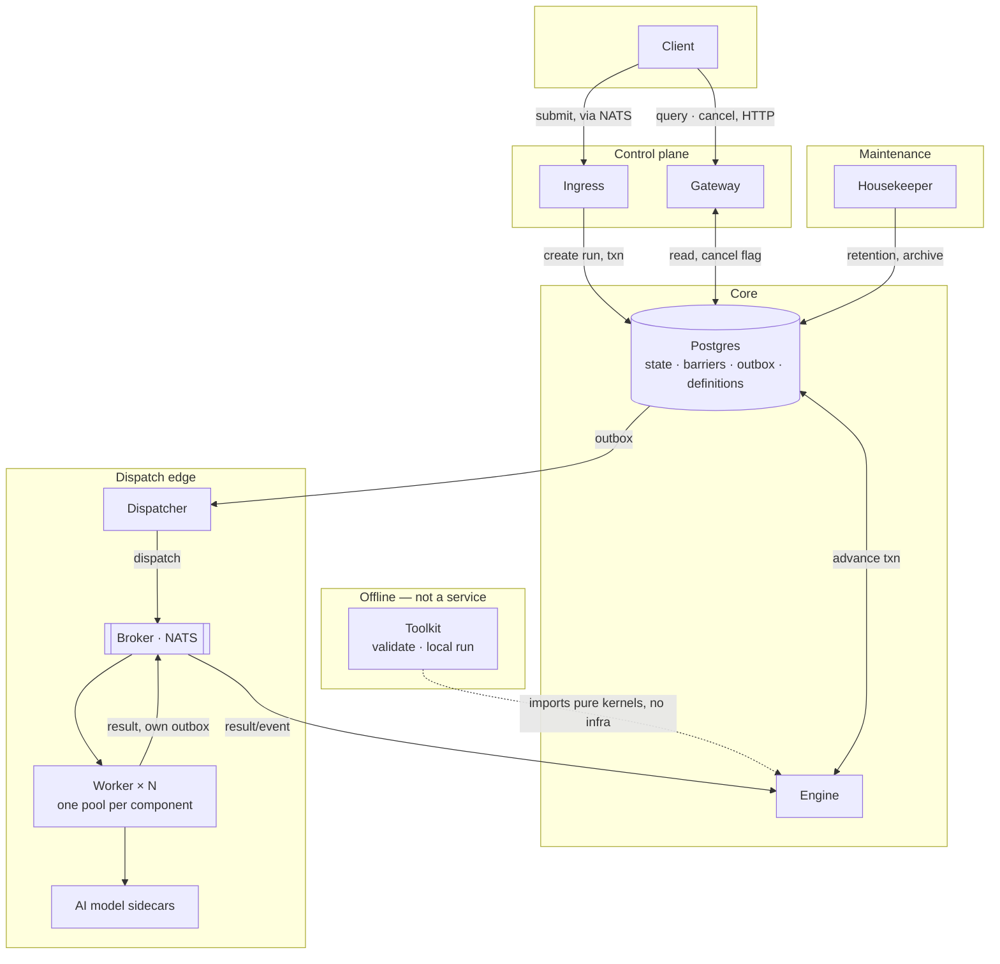

# pneuma v2 — service decomposition

> Synthesizes `CONCURRENCY-AND-DIRECTION.md` (Postgres-only + transactional advance), `PREGEL-NOTES.md` (combiner barrier, vote-to-halt termination), and `STRATEGY.md` (the four differentiators) into an actual service topology. This **supersedes** the original plan's "mirror today's 6 binaries" decision — that was the right call for a *safe, incremental port*; this is the answer to "if you were starting from what you now know."

## The rule I used to draw boundaries

Not "one service per current file" and not "one service per feature." A boundary earns its existence only if it has a **genuinely different scaling axis, failure blast radius, ownership, or I/O interaction model** from its neighbors. Applied honestly, this deletes one service, splits one in two for a real reason, and leaves the rest recognizable but narrower.

The fourth criterion — I/O interaction model — was missing from my first pass and is worth stating explicitly: an event-driven consumer loop (pull-based, backpressure from queue depth, readiness means "connected and caught up," shutdown means "drain in-flight consumption") and a synchronous HTTP request/response server (scaling trigger is concurrent connections/latency, readiness means "accepting connections," shutdown means "stop accepting new ones") are different runtime shapes even when they sit on the same data and serve overlapping purposes. Ingress and Gateway are the clearest example (§1, §5) and the reason to keep them apart even though both are thin, mostly-stateless request handlers over the same Postgres.

---

## The six components

| # | Component | Scaling axis | Failure blast radius if it's down |
|---|---|---|---|
| 1 | **Ingress** | job submission rate | new jobs queue up; in-flight runs unaffected |
| 2 | **Engine** | in-flight step-transition rate | runs stop advancing; nothing corrupts, nothing duplicates |
| 3 | **Dispatcher** | total dispatch rate across all components/tenants | advance transactions still commit; work just backs up in the outbox |
| 4 | **Worker** (× N pools) | per-component / per-tenant inference load | only that component's steps stall |
| 5 | **Gateway** | external read/cancel traffic | pipeline keeps running; only visibility/cancel is degraded |
| 6 | **Housekeeper** | none (scheduled) | retention slips; nothing on the hot path notices |
| — | **Toolkit** | n/a — not deployed | n/a |

**Substrate, not services:** one Postgres cluster (state, barriers, outbox, pipeline/component definitions — Mongo is gone, per `CONCURRENCY-AND-DIRECTION.md` Part 2), one broker for dispatch-and-result transport only.

---

## 1. Ingress — *was bootstrap*

Accepts a job submission, resolves the pipeline definition, and in **one transaction** creates the run header and the initial noderun rows. That's the entire job. It never touches the broker directly to publish work — the first dispatch happens exactly the same way every later one does: via the outbox, drained by the Dispatcher (§3). This removes bootstrap's own dual-write hazard (`CONCURRENCY-AND-DIRECTION.md` §1.1) at the very first step, for free, by construction — the general mechanism handles the first message and every later one identically.

Stays a genuinely separate service for two independent reasons, not one: submission-rate scaling has nothing to do with in-flight-run scaling (a burst of new jobs shouldn't compete with the Engine for its DB connections), and — the sharper reason — it's a *consumer*, not a *server*. Its I/O shape is a durable-consumer loop against the broker: pull-based, backpressure from queue depth, readiness means "connected and caught up," graceful shutdown means "finish draining in-flight consumption." That's a different runtime discipline from Gateway's synchronous request/response HTTP server (§5), even though both services are otherwise thin and sit on the same Postgres. Client submission moves from RabbitMQ to NATS along with everything else (§ brokers, below) — nothing about Ingress's role changes, only its transport dependency.

## 2. Engine — *was controller, with dispatch surgically removed*

The smallest, purest, most heavily-tested component, and the one place I'd spend the most engineering care. Consumes `result`/`event` messages and executes the **transactional advance**: guarded status transition, combiner-scoped barrier arrival (`PREGEL-NOTES.md`), successor noderun creation, and an outbox row — all in one Postgres transaction, all idempotent via `ON CONFLICT DO NOTHING`. It does not call NATS. It does not call HTTP. It touches Postgres and nothing else.

That constraint is the whole point: **any replica can process any message for any run**, because there is no per-run affinity anywhere in this service — which is exactly differentiator #1/#3 from `STRATEGY.md` made real, not just claimed. It's also why this is the one component that inherits `pneuma-core`'s pure kernels almost unchanged (resolver, evaluator, `plan_join`, `walk_step`) behind a thin transactional shell — which is what makes the Toolkit (§7) nearly free.

**What used to live here and doesn't anymore:** the retry-message self-loop (`MessageRetry` and its subject) — gone, replaced by lease expiry + broker-native redelivery. The racy `_try_aggregate` re-read — gone, replaced by the combiner's atomic delivery. The termination-signal consumption — gone, moved to §3/§4 because "is this cancelled" is now a plain Postgres read, not a NATS-ping-triggered cache refresh against a broken REST endpoint.

## 3. Dispatcher — *new; absorbs broker entirely, and half of what the original executor used to do*

This is the one genuinely new boundary, and it exists because three unrelated things used to be smeared across two-and-a-half services for no principled reason:

- **Draining the outbox** to the broker, with idempotency keys and the broker's dedup window doing real work (`LANDSCAPE-AND-EVOLUTION.md` §3.5).
- **Tenant routing.** `sprintf("%s.tenant_%s", ...)` — broker's entire reason to exist — becomes one step in this service instead of an entire separate deployment, network hop, durable consumer, and lossy JSON re-marshal (the survey notes). Deleting broker isn't a simplification for its own sake — it's the original plan, now answered: fold it in, but into the Dispatcher, not into the Engine, because dispatch and advance have genuinely different failure profiles (a broker outage should never block a DB transaction from committing).
- **Tenant isolation done properly.** Since every dispatch already passes through one chokepoint, this is where per-tenant rate limiting and quota enforcement actually belong — turning `STRATEGY.md` differentiator #4 from "a subject suffix with no enforcement" into something real, in the one place it's cheap to enforce.
- **The cancellation check.** Because storage is unified now, "is this job cancelled?" is a plain indexed Postgres read taken *before* a dispatch is sent — not a NATS fan-out ping that triggers a poll against an endpoint that (per the survey notes) has been silently broken. This is strictly simpler and strictly more correct than what exists today.

Separated from the Engine specifically so that broker connectivity problems degrade to "work backs up in a durable outbox table" rather than "DB transactions start failing." Separated from Worker because its scaling axis (aggregate dispatch throughput) is unrelated to any single component's inference capacity.

**How it actually scales — two tiers, not one, and I understated the difference between them the first time.**

*Tier 1, close to free:* the mechanism isn't sharding, it's `SELECT ... FOR UPDATE SKIP LOCKED` — the standard Postgres competing-consumers pattern for a table-backed queue (9.5+). N Dispatcher replicas poll the *same* outbox table; each grabs a batch and row-locks it; the rest skip locked rows and move to the next batch. Zero partitioning, zero routing, zero coordination logic. This is what gives you N dispatcher pods for nothing, up to the point where the single Postgres primary itself is the bottleneck. Order-of-magnitude, a well-tuned primary plausibly sustains tens of thousands of simple indexed writes/sec on a table this shape — an estimate, not a number I've benchmarked against this schema, so treat Tier 1 as "probably enough for a long time" and measure before assuming otherwise.

*Tier 2, genuinely not embarrassing:* scaling past one Postgres primary requires real horizontal partitioning — every writer (Ingress, Engine, Dispatcher) has to route to the correct shard, Gateway's reads and Housekeeper's retention sweep need cross-shard fan-out, and uneven tenant growth needs a rebalancing story. That's Citus/Yugabyte/CockroachDB or hand-rolled application sharding — real scope, not a footnote.

**If Tier 2 is ever needed, shard by `tenant_id`, not `run_id`.** Hashing by `run_id` buys nothing over Tier 1 and actively works against the design: it scatters one tenant's data across every shard for zero benefit, since nothing in this system needs cross-run atomicity within a tenant. Sharding by `tenant_id` gets scalability and isolation in the same move — it's the same axis as differentiator #4 in `STRATEGY.md`, so almost every query stays single-shard for free, and a noisy tenant's shard can be split off in isolation instead of degrading everyone else. Don't build this speculatively; measure real outbox write throughput on Tier 1 first.

## 4. Worker — *was the original executor, unchanged in shape, corrected in mechanism*

One deployment per AI component — this part of the existing design was already right and stays exactly as-is topologically. What changes is entirely mechanism, and it's where `STRATEGY.md` differentiator #2 (zero-SDK component contract) actually lives:

- **Leases, not ack-window guessing.** Replaces `CONSUMER_ACK_WAIT` vs `REQUEST_TIMEOUT` (the survey notes) with an explicit `attempt_id` + heartbeat, per `CONCURRENCY-AND-DIRECTION.md` §Path A2. A slow model no longer causes duplicate dispatch.
- **Pull, not poll.** Replaces the subject-cardinality-scanning producer (the survey notes) with a durable consumer filtered to this component's queue. No loop that grows with tenant count.
- **A local, cheap cancellation cache**, refreshed from Postgres (or via Gateway) rather than the currently-broken termination-list endpoint — defense in depth underneath the Dispatcher's check, for the case where a job is cancelled after dispatch but before the model call starts.
- **Its own outbox for results**, not a bare `Publish`. The same discipline the Engine and Dispatcher use, for the same reason: a crash between "inference finished" and "result published" shouldn't lose the result.
- **The contract itself, unchanged and now documented as a product surface**: `{"jsonData": {...}} → {"jsonData": {"step_output": ...}}` over one HTTP endpoint, no SDK, no language binding, works with any existing model server. This service is the *implementation* of the differentiator; the differentiator itself is the contract, not the binary.

## 5. Gateway — *unchanged in role, simplified underneath, expanded on top*

Stays exactly what it already is: the external read/query and cancellation control plane, and (per the original plan's ADR-009 finding) correctly its own separate repo joining the platform at runtime — that convention doesn't change. What changes:

- **Loses its Mongo dependency entirely.** Postgres consolidation means Gateway becomes a single-database service, which is a straightforward simplification of code that already exists, not new work.
- **Cancellation becomes a flag write, not a fan-out-and-poll dance.** `POST /terminations` writes the row and sets a flag the Dispatcher and Worker both read directly. The NATS refresh-ping becomes optional defense-in-depth rather than the only mechanism — worth keeping (it's genuinely well-built, per the original plan's convention extraction) but no longer load-bearing.
- **Gains the run-inspector surface** from `STRATEGY.md` Phase 3 — barrier/mailbox state, dispatch history, the parent-chain view — because it's already the one service whose job is "external things query pipeline state," and that's a natural, not forced, extension of its existing responsibility.

## 6. Housekeeper — *was janitor, radically simpler*

Retention, archival, stale-run cleanup — same job, but "is this run actually finished" stops being a heuristic timeout guess and becomes the checkable invariant from `PREGEL-NOTES.md`: every reachable vertex halted, outbox empty for that run. Runs as a scheduled job (k8s CronJob), not a long-lived daemon, per the earlier recommendation — nothing about its role needs a persistent process.

## 7. Toolkit — *new, and deliberately not a service*

`pneuma validate pipeline.yaml` and `pneuma run --local` (`STRATEGY.md` Phase 3), built by importing the Engine's pure kernels directly with in-memory fake ports — the same fakes the test suite already needs to exist (the original plan's testing strategy). This has to be a CLI/library, not a deployment, or it defeats its own purpose: a pipeline author should be able to catch a cyclic graph or a missing child reference on their laptop, with nothing running, before it becomes a silent production hang (the survey notes).

---

## What this deletes, splits, and merges — versus today

| Today | v2 | Why |
|---|---|---|
| bootstrap | → Ingress | same job, first dispatch now goes through the same outbox as every other dispatch |
| controller | → Engine (advance only) | dispatch surgically removed to its own failure domain |
| controller's publish path + broker + half of the original executor's routing | → **Dispatcher** (new) | one chokepoint for outbox drain, tenant routing, quota enforcement, cancellation check — previously three inconsistent implementations |
| broker | **deleted** | folded into Dispatcher; the original plan, resolved |
| the original executor | → Worker | same topology, corrected mechanism (leases, pull, own outbox, local cancel cache) |
| gateway | → Gateway | same role, drops Mongo, gains run-inspector |
| janitor | → Housekeeper | same job, correctness check is now an invariant not a heuristic |
| retry subject / `MessageRetry` | **deleted** | superseded by lease expiry + broker redelivery |
| termination NATS ping + gateway poll (currently broken) | **downgraded to defense-in-depth** | primary mechanism is now a direct Postgres read at the Dispatcher/Worker |
| Mongo | **deleted** | Postgres-only, per `CONCURRENCY-AND-DIRECTION.md` Part 2 |
| — | **Toolkit** (new, not deployed) | validate/local-run, the direct payoff of workflow-as-data |

Net: **six deployable services instead of six** — but the set is different (broker is gone, Dispatcher is new), and every remaining boundary now has a stated reason instead of being an accident of "this used to be a separate the original repo."

## Two concerns that fell out of review, worth carrying forward

**The two-tier scaling story is system-wide, not Dispatcher-specific.** Tier 1 scales *compute* (clone a stateless process — cheap, unlimited in practice). Tier 2 scales *state* (partition data across nodes — expensive, real distributed-systems scope: every writer needs shard routing, reads need cross-shard fan-out, hot shards need rebalancing). Because the Postgres consolidation (`CONCURRENCY-AND-DIRECTION.md` Part 2) put the ledger, the barrier/mailbox table, and the outbox in one database *by design* — specifically to get transactional atomicity across them — Ingress, Engine, Dispatcher, Gateway, and Housekeeper are all independently Tier-1-scalable but share one Tier-2 ceiling. You don't get to shard the outbox without sharding its neighbors, because the Engine's advance transaction touches several of them together.

Two costs this incurs that weren't priced in earlier:

- **Postgres is now a hard SPOF for the whole platform** — previously, either database going down only partially degraded the system; now it's everything. HA Postgres (fast-failover primary/standby) is load-bearing infrastructure from day one, not later hardening.
- **A "Tier 1.5" is worth having before Tier 2 is ever on the table: separate Postgres *instances* by workload shape, not by shard key.** The Engine's advance transactions are complex, multi-statement, lock-heavy. The Dispatcher's outbox drain is simple, high-churn `SKIP LOCKED` polling with heavy insert/delete turnover — real autovacuum and bloat pressure at volume, and if autovacuum falls behind on that table, both workloads sharing the instance degrade, not just the one causing it. Splitting "the ledger" (durability-sensitive, lower churn) from "the queue-shaped tables" (throughput-sensitive, high churn) onto separate instances buys real headroom with zero application-level sharding logic. Measure for it specifically — dead-tuple ratio and autovacuum lag on the outbox/mailbox tables — rather than assuming it's needed.
- If `tenant_id`-sharding (Tier 2) is ever built, it composes for free with **data residency** — a tenant's shard can live in their required region. Not a reason to build it now, just a reason `tenant_id` over `run_id` keeps paying off.

**The Dispatcher's cancellation check needs a cache, not a query per dispatch.** As specified in §3, "is this cancelled?" is a plain Postgres read before every dispatch — at volume that's one extra read per dispatch on the same primary already serving the Engine's writes. Fix: a targeted index lookup (a boolean column, never a join), held in an in-memory cache per Dispatcher replica with a short TTL, refreshed the same best-effort way Gateway's termination-signal publisher already works (the original plan's convention extraction). The mechanism was specified without being priced; this is the correction.

## On "fully async and stateless" vs. Temporal — a precise claim, not a flattering one

Worth stating carefully because part of the intuitive framing doesn't survive scrutiny, and the part that does is stronger for being narrower.

Temporal workers genuinely [long-poll the Temporal Service's task queues](https://docs.temporal.io/workers), and Temporal has real per-execution affinity — [**Sticky Execution**](https://docs.temporal.io/sticky-execution): after a worker processes a workflow task, it caches that execution's state in memory, and the server routes subsequent tasks for the *same* execution back to that *same* worker via an auto-generated sticky queue, to avoid re-replaying event history. Both of those are accurate.

**What isn't accurate:** contrasting this against pneuma as "they poll, we don't." The Worker design here (§4) standardizes on NATS JetStream **pull consumers** — `Fetch(batch, timeout)` — which is the same shape as a long-poll: ask the broker for work, block until some arrives, ask again. Both systems have a worker loop asking "give me work." That's not where the real difference is.

**Where it actually is:** *what's being polled and what state it holds.* Temporal's poll target is a smart, centralized, stateful scheduler that owns per-execution event history and makes sticky-routing decisions — that server is itself the thing that has to scale and be made highly available. pneuma's poll target is a domain-ignorant NATS stream; all state and decision-making lives in Postgres, touched transactionally by whichever replica happens to pick up a message. **No process here caches per-run state in memory, and no message is ever preferentially routed to whichever replica handled the last one for that run** — every replica is fully interchangeable and disposable, at every moment.

That's the real, verifiable claim, and the win it actually buys: trivial autoscaling (no warm cache to lose, nothing to rebalance), no sticky-worker failure domain (a dead Temporal worker holding a hot execution's cache costs that execution a full replay on its next task; nothing here has an equivalent cliff, because nothing was ever cached), and uneventful rolling deploys. **Don't externally frame this as "async vs. polling"** — that's checkable and wrong. Frame it as "no centralized stateful scheduler, no per-execution affinity, fully disposable compute" — narrower, true, and falsifiable, which makes it a better claim in the `STRATEGY.md` sense, not a weaker one.

(JetStream does support real push consumers — zero-poll delivery is available in the substrate if it ever mattered. Recommend against it: pull-with-`Fetch()` is what gives bounded backpressure, and losing that would reintroduce exactly the failure mode this redesign exists to remove — a broker firing messages faster than a worker can safely absorb them.)

**One more precision pass, because "polling is inefficient" and "polling is memory-heavy" are not the same claim, and only the second one is really true of Temporal.** [Temporal's own tuning docs are explicit](https://docs.temporal.io/develop/worker-tuning-reference) that pollers aren't the memory driver — the [**sticky workflow cache**](https://community.temporal.io/t/understanding-sticky-cache-size/11407) is: a worker caches live workflow state in memory to avoid replaying event history, default 10,000 cached workflows (Go SDK) / 600 per host (Java SDK), a documented, tunable, real production memory cost. Long-polling itself is cheap — a parked network read, not a spin loop. The correct, narrower claim: it's not *synchronicity* that costs memory, it's the *event-sourcing-plus-replay recovery model*, which requires a worker-side cache to make replay affordable.

This sharpens who else has already solved it, and the answer is genuinely useful: **not trivial, and not unsolved — two unrelated projects converged on pneuma's answer.** DBOS's recovery [re-runs the workflow function but skips already-checkpointed steps via cheap Postgres lookups](https://docs.dbos.dev/production/workflow-recovery) — no event-history reconstruction, no dedicated sized cache. Restate externalizes state into its own server cluster — a [global memory budget plus its own internal log cache](https://docs.restate.dev/server/memory), tuned as shared infrastructure, not per deployed replica (worth being precise: Restate does have *some* affinity — [invocations are sticky to partitions with strong leaders](https://github.com/restatedev/restate/blob/main/release-notes/v1.6.0.md) — but that stickiness lives in Restate's own infra, never in your stateless handlers). Both rejected "cache execution state inside your own horizontally-scaled compute" and pushed it into dedicated shared infrastructure instead, exactly pneuma's shape with Postgres playing that role. Temporal is the older, event-sourcing-era architecture that predates this convergence. The credible external claim is therefore not "we invented statelessness" — it's "we made the same call the newer generation of durable-execution systems independently made, for the same reason."

## Resolved on review

- **One broker, not two.** The RabbitMQ/NATS split was a legacy-adaptation artifact, not a technical requirement — confirmed, not inferred. Consolidate onto NATS JetStream: Ingress consumes submissions from it (§1), Dispatcher publishes work to it (§3), Gateway's client callbacks move onto it too. **One piece of homework before fully committing:** RabbitMQ's quorum queues + DLX currently back the client callback delivery path; that guarantee needs to be re-verified as achievable on a JetStream durable stream with explicit ack and a real DLQ policy, rather than assumed equivalent. Likely fine — worth confirming once rather than discovering a gap in production.
- **Ingress and Gateway stay separate services**, and the real reason is sharper than "different trust boundaries": they have different **I/O interaction models** (§ the rule, above) — Ingress is a pull-based durable-consumer loop, Gateway is a synchronous HTTP server. That's a different runtime discipline, not just a different traffic source.
- **Dispatcher's scaling story, corrected** — see §3 above. Replica scaling is close to free via `SKIP LOCKED` competing-consumer polling on one outbox table, not "sharding by run-id hash" as I first (wrongly) put it. Real horizontal sharding past one Postgres primary is genuine scope, not embarrassing, and if it's ever needed the key is `tenant_id`, which buys isolation and scalability together — `run_id` would buy neither.

## What I'd still genuinely reconsider

- **Dispatcher as a single logical service vs. pre-emptively partitioned.** Tier 1 (`SKIP LOCKED`) is almost certainly sufficient for a long time; I have no measured throughput number for this schema, so "when does Tier 2 become necessary" is an open, measurable question rather than a design decision to make now.
