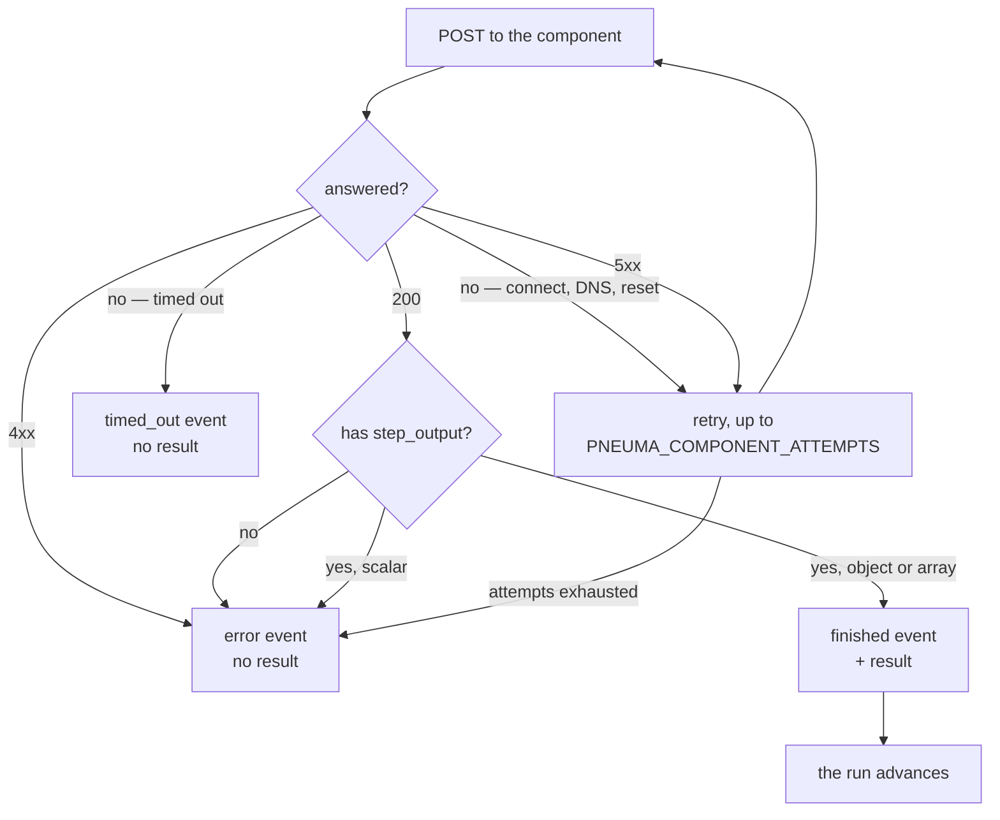

# The component API — specification

**This page is a specification, not a description.** It is the whole contract
between pneuma and an AI component. A component is one HTTP endpoint; there is
no SDK, no library, and no language requirement.

> **This changed, and it breaks every deployed model.** The request and response
> used to be wrapped in a `jsonData` object. That wrapper is gone. There is no
> dual-read and no compatibility shim — see [why](#why-the-wrapper-went). A
> model that has not been rebuilt will fail on its first call.

## The contract

```
POST {PNEUMA_COMPONENT_ENDPOINT}
Content-Type: application/json
```

### Request

```json
{
  "meta": {
    "job_id": "job-1",
    "tenant_id": "acme",
    "pipeline_type": "invoice",
    "pipeline_level": "page",
    "pipeline_name": "default"
  },
  "step_input": { "doc": "invoice-0001.pdf", "page": 1 },
  "custom_data": { "requested_by": "batch-loader" },
  "node_env_vars": { "MODEL_VARIANT": "large" },
  "headers": { "traceparent": "00-4bf92f3577b34da6a3ce929d0e0e4736-00f067aa0ba902b7-01" }
}
```

| Key | Type | Always present | Meaning |
|---|---|---|---|
| `meta` | object, exactly five keys | yes | which tenant and which pipeline this call belongs to |
| `step_input` | any JSON value | yes | what this step is being given |
| `custom_data` | any JSON value | **no** | caller passthrough, forwarded unchanged |
| `node_env_vars` | object of string→string | **no** | per-node configuration overrides |
| `headers` | object of string→string | **no** | W3C trace context |

**`meta` has exactly those five keys and no more.** It is deliberately narrower
than the envelope pneuma passes internally: there is no `pipeline_id` and no
caller extra. A component that validates its input strictly, or that echoes it
back, would otherwise see keys production never sends.

**Absent is not empty.** `custom_data`, `node_env_vars` and `headers` are
omitted from the JSON entirely when there is nothing to send — not sent as
`null` or `{}`. A component may distinguish the two, and is entitled to.

### Response

```json
{
  "step_output": { "total": "129.90", "currency": "EUR", "confidence": 0.97 }
}
```

| Key | Type | Required |
|---|---|---|
| `step_output` | **object or array** | yes |

That is the entire response contract. Any other key is ignored.

**`step_output` must be an object or an array.** A scalar — `"hello"`, `3`,
`true` — is refused. This is worth stating because the original services
*forwarded* a scalar happily and the original controller then rejected it one
service away from the component that produced it. Refusing it here means the
failure is attributed to the component that caused it.

A `200` with no `step_output` is a component that answered without answering. It
is not retried and it is not treated as success: the step ends, the run is told,
and the failure names the node.

### What the two shapes were

| | Before | Now |
|---|---|---|
| request | `{"jsonData": {"meta": …, "step_input": …}}` | `{"meta": …, "step_input": …}` |
| response | `{"jsonData": {"step_output": …}}` | `{"step_output": …}` |

Porting a component is deleting one level of nesting at each end.

## Worked example

A component that extracts a total from one page of an invoice.

**pneuma sends:**

```http
POST /predict HTTP/1.1
Host: invoice-extract.models.svc:9000
Content-Type: application/json

{"meta":{"job_id":"job-7f3a","tenant_id":"acme","pipeline_type":"invoice","pipeline_level":"page","pipeline_name":"default"},"step_input":{"doc":"s3://bucket/invoice-0001.pdf","page":4}}
```

Note what is *not* there: no `custom_data`, no `node_env_vars`, no `headers`,
because this run set none of them.

**The component answers:**

```http
HTTP/1.1 200 OK
Content-Type: application/json

{"step_output":{"total":"129.90","currency":"EUR","line_items":3}}
```

**A minimal component, in whatever you already have:**

```reference
from flask import Flask, request, jsonify

app = Flask(__name__)

@app.post("/predict")
def predict():
    body = request.get_json()
    page = body["step_input"]["page"]
    doc = body["step_input"]["doc"]
    # meta tells you who this is for; node_env_vars may not be there at all.
    variant = (body.get("node_env_vars") or {}).get("MODEL_VARIANT", "base")
    result = extract(doc, page, variant)
    # An object or an array. Never a bare string or number.
    return jsonify(step_output=result)
```

## How pneuma treats what comes back



The classification is derived from **typed** predicates on the HTTP client, not
from matching substrings in a printed error message. The original did the
latter, which means a library upgrade that rewords an error silently changes
which failures are retried.

**Three answers, not two.** Retry, dead-letter, or done. A transport that only
knows ack-and-drop loses work on a network blip; one that only knows
ack-and-requeue spins for ever on a poison message.

## Timeouts, and what bounds them

`PNEUMA_COMPONENT_TIMEOUT_SECS` defaults to **300** — five minutes, because
these are inference calls and some of them legitimately take minutes.

On the Restate path there is a second bound worth knowing about: it is
Restate's **`abort-timeout`** that bounds a `ctx.run`, **not**
`inactivity-timeout`. That was measured rather than read
(the design notes), and getting it backwards
means a long component call is killed by a setting nobody thought applied to it.

## What a component must not assume

- **That it will be called once.** A retry, a redelivery, or a Restate replay
  can call it again with the same `step_input`. A component that has side
  effects should key them on `meta.job_id` plus the step's input.
- **That `meta` will grow.** It will not. Five keys is the contract; anything a
  caller wants a component to see goes in `custom_data`.
- **That the transport is NATS, or HTTP, or anything.** The same request is
  produced by `pneuma-restate` over a journalled call and by `pneuma-executor`
  after a NATS delivery. A component cannot tell, and must not need to.

## Why the wrapper went

`{"jsonData": …}` was Seldon v1's envelope for a custom payload, inherited along
with a module named `seldon.rs`. It named nothing about this system and carried
no information: a request has exactly one body, so a key saying "here is the
body" is a level of nesting every producer and every consumer paid for and
nothing read.

It was dropped rather than renamed. Once compatibility with the originals was
given up anyway — for the reasons in
The design notes — keeping a one-key envelope
only to spell it differently would have been the churn without the
simplification.

**And no shim.** A dual-read that accepts both shapes is a shim nobody ever
removes; it would live in this codebase for the life of the system so that a
model nobody maintains keeps half-working. The failure is instead loud and
immediate, which is the version an operator can act on.

There is one thing this page cannot do: prove the models agree. They are not in
this repository. What *is* verified is that pneuma is self-consistent — both
services that call a component send this shape, the reader accepts this shape,
and the NATS driver re-wraps a bare step output into it. The stub components in
every test speak this protocol, which is what makes a half-applied change fail.
