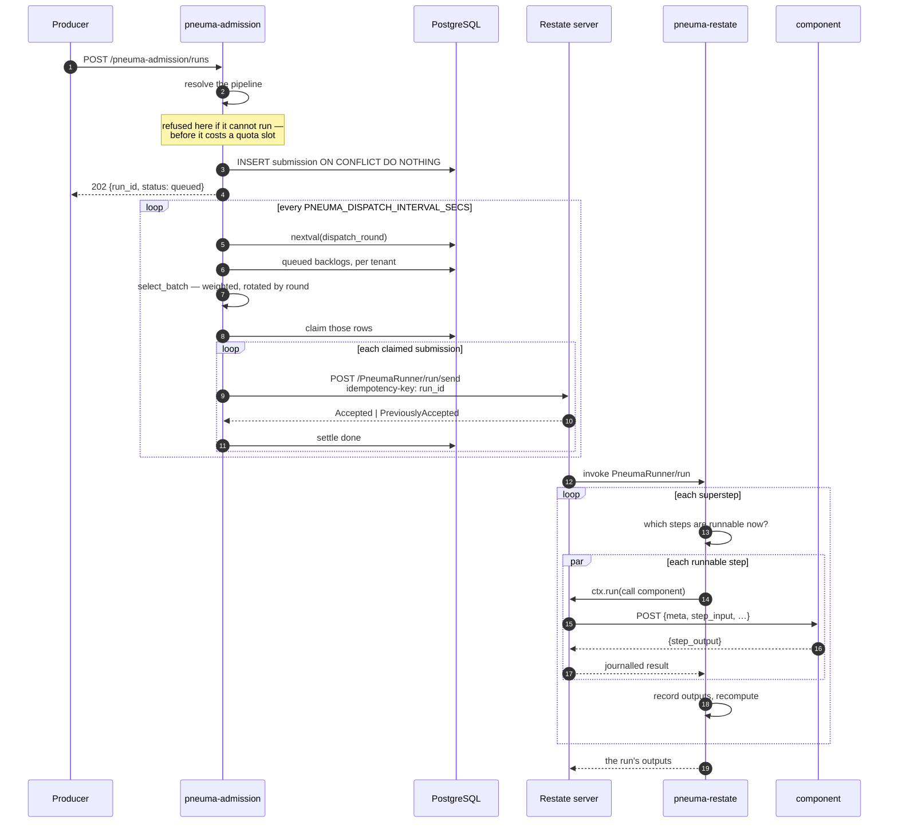
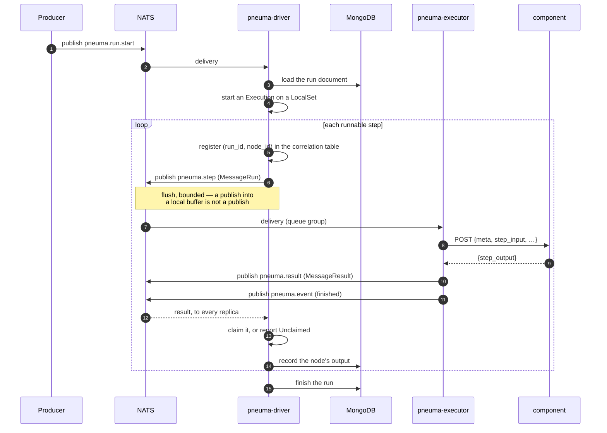
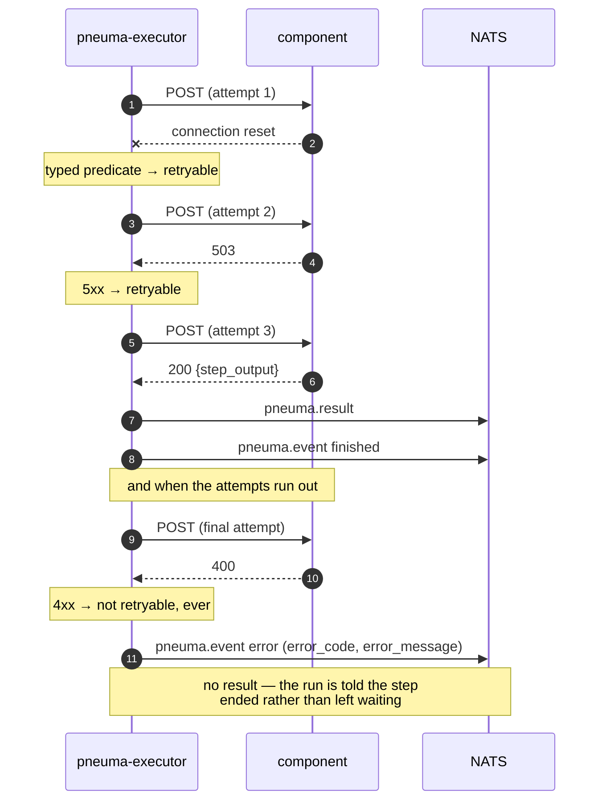
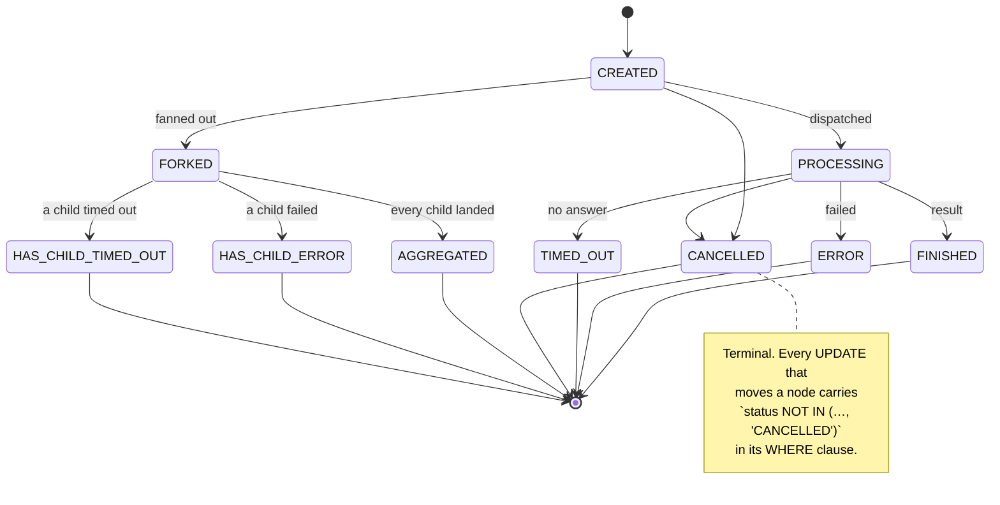
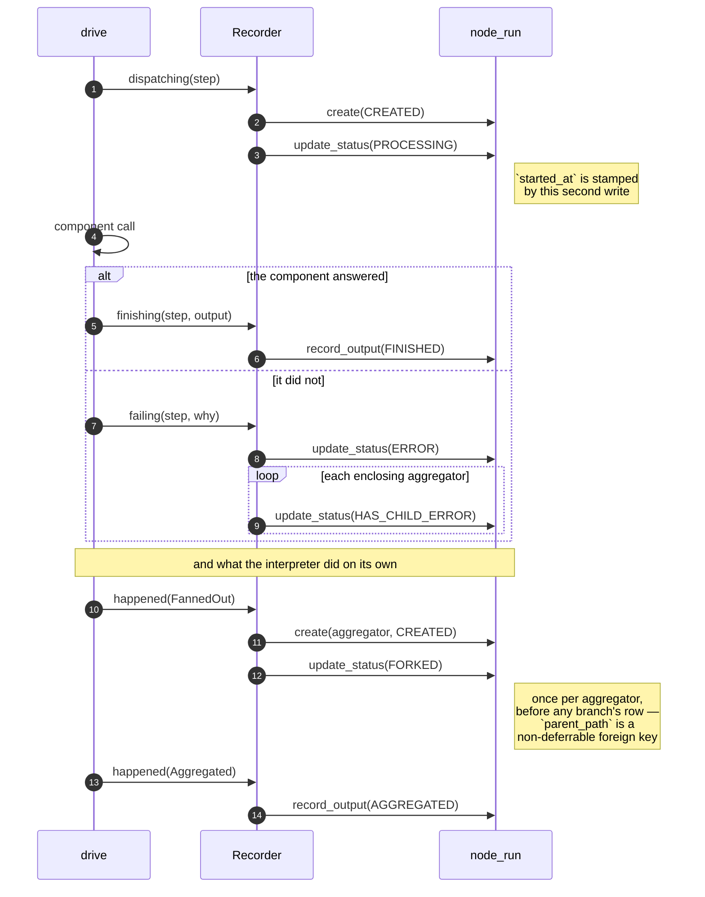
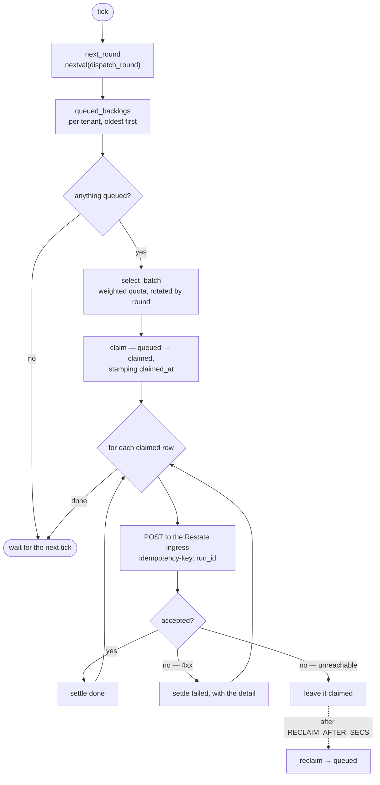
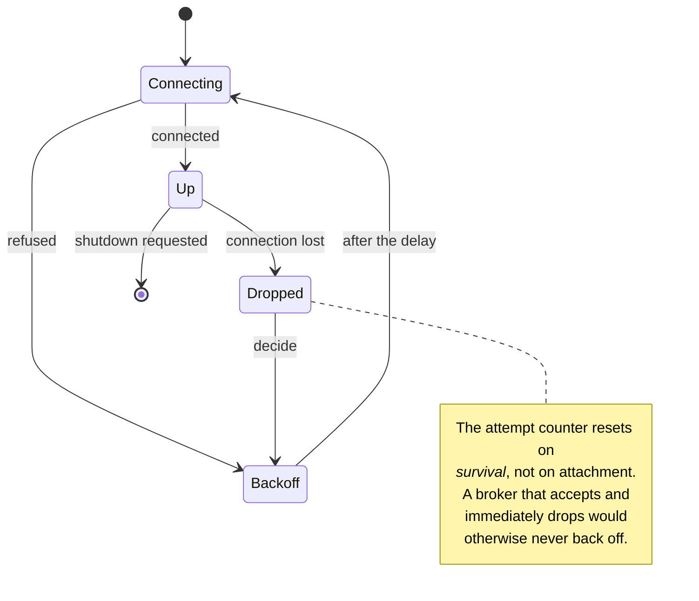
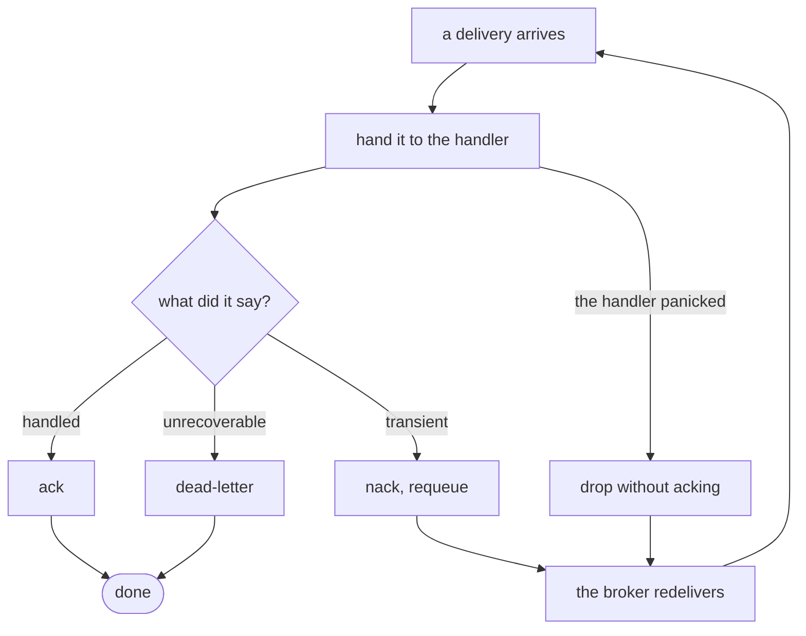

# Flows — how a run actually happens

Five diagrams: the primary path end to end, the fallback path, a component
failure, cancellation, and the two background loops that keep the system honest.

## 1. Submission to completion — the Restate path

**Why a claim, and why it can be reclaimed.** Between `claim` and `settle` the
dispatcher can die. The row stays `claimed` with a `claimed_at`, and after
`PNEUMA_RECLAIM_AFTER_SECS` the sweep returns it to `queued`. Without that, a
dispatcher crash strands every submission it had in flight.

**Why the round comes from a sequence.** `select_batch` rotates its tie-break by
the round number, and a batch that does not divide evenly has to hand the
remainder to somebody. With a per-process counter that is the same tenant every
time — measured at 800 items against 600 over 200 rounds, while every individual
batch was provably fair. Two replicas with their own counters both sit near zero
and favour the same tenant. A sequence is the one counter shared and monotonic
across both.

## 2. Submission to completion — the NATS path

**Why every replica sees every result.** The executor publishes to a *fixed
configured subject*, not to a reply inbox, so NATS request–reply is not
available. A run's `Execution` lives in the replica that started it, so the
subscription is plain rather than a queue group: the replica holding the run
claims the result and the others say `Unclaimed`. A queue group here would
deliver a result to a replica that has never heard of the run.

**Why a `LocalSet`.** `Component::call` deliberately promises no `Send`, because
the primary implementation is Restate's `ctx.run`, which returns a future with
no `Send` bound. Requiring `Send` on the trait would have made the *primary*
transport unimplementable in order to make the fallback more convenient.

## 3. A component that fails

The distinction that matters: an error event **without** a result still advances
the run. The original's failure mode was a node that stayed `PROCESSING` for
ever because the only thing that would have moved it was a result that was never
coming.

## 4. Cancellation, and why a late result cannot undo it

The guard is the `WHERE` clause, not a read-then-write. The original read the
row `FOR UPDATE`, decided in original, then issued a separate `UPDATE` — and
`CANCELLED` was missing from its terminal list, so a result arriving after a
cancellation resurrected the node. Here the decision and the write are one
statement and there is no window between them
(the design notes).

`FORKED` has a second rule: a node may only become `FORKED` **from** `CREATED`.
That too is in the `WHERE`.

### Who writes these rows, and when

The diagram above was aspirational until the design notes: `node_run` had a
schema, a store and a janitor, and no producer at all. Both drive paths now
write it, through one `Recorder` (`pneuma-mirror`) over derivation that is pure
and shared (`pneuma_runner::record`), so a fan-out records the same way under
Restate as under the broker.

Two writes for one dispatch, because both instants collapse into one here and
`FORKED` is admitted only *from* `CREATED` — so a step that went straight to
`PROCESSING` would leave its aggregator unable to fork. `TIMED_OUT` and
`HAS_CHILD_TIMED_OUT` appear in the diagram above and are never written: the
transport does not say whether a failure was a timeout or a refusal, so every
failure is `ERROR`. Both are §25.

## 5. The dispatch round

**An unreachable Restate leaves the row claimed on purpose.** Settling it
`failed` would be a permanent verdict on a transient problem; the reclaim sweep
is what turns "we could not reach it" back into "try again".

## 6. Reconnect supervision

Both brokers share one supervisor, because the decision is the same for both.

That note is a real bug that was caught in review: resetting the counter on
`Up` meant a flapping broker was reconnected to as fast as the loop could spin.
The reset is now gated on the connection having *lasted*, which is what
`Dropped { after }` carries.

## 7. Delivery settlement

A `Settle` that panics **during unwinding** aborts the process, so the drop path
catches. That is not defensive programming for its own sake: the drop path runs
inside `Drop`, and a panic there while already panicking is an immediate abort
with no chance to log why.
