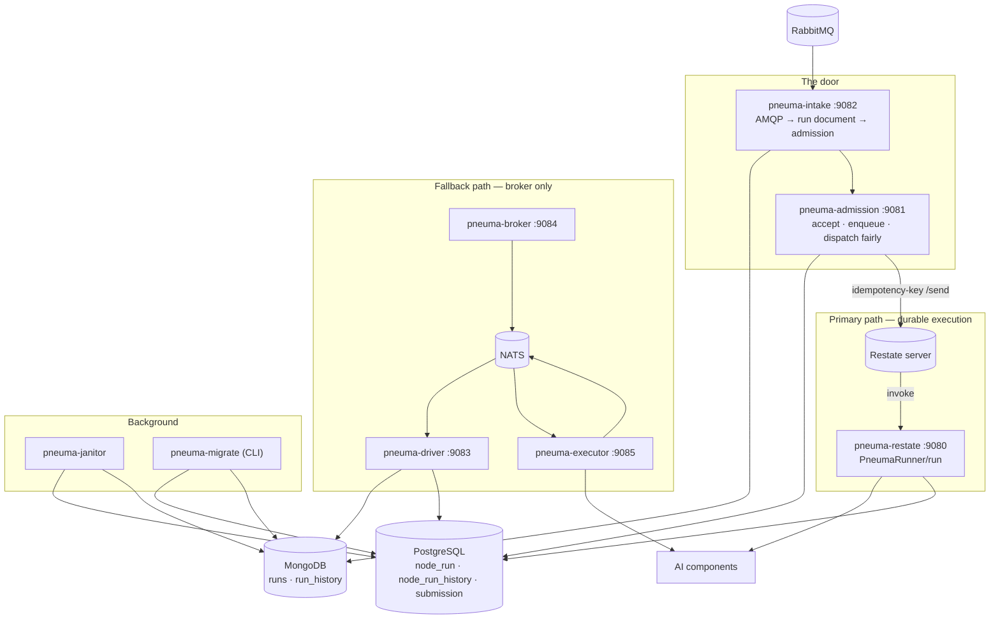
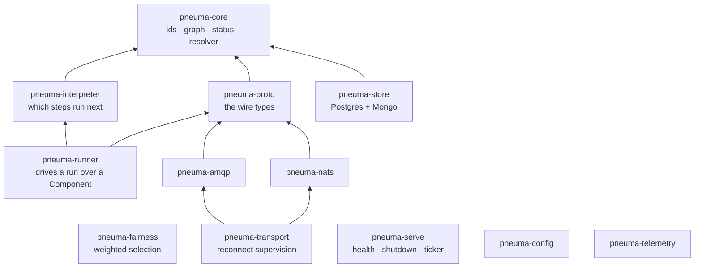

# As-built — the eight services

This is the system that exists: implemented, tested against real infrastructure,
and held at 100% line coverage by [`../verification.md`](../verification.md).

## The services

| Binary | Port | What it is | Talks to |
|---|---|---|---|
| `pneuma-admission` | 9081 | the front door and the fair dispatcher | HTTP in, Postgres, Restate ingress |
| `pneuma-intake` | 9082 | the AMQP door: run, event and pipeline messages | RabbitMQ, MongoDB, admission |
| `pneuma-restate` | 9080 | the durable execution handler | Restate server, components |
| `pneuma-driver` | 9083 | the NATS-path run driver | NATS, MongoDB |
| `pneuma-broker` | 9084 | routes a message onto its tenant's subject | NATS |
| `pneuma-executor` | 9085 | calls a component and publishes the result | NATS, components |
| `pneuma-janitor` | 9086 | archives finished runs, terminates stale ones | Postgres, MongoDB, gateway |
| `pneuma-migrate` | — | schema migration and adoption; a CLI, not a server | Postgres, MongoDB |

Every long-running binary serves `GET /{service}/healthz` and
`GET /{service}/liveness` on its port — prefixed with the service name because
these are reached through one ingress, and an unprefixed `/healthz` on six
services is one route six ways.

## Topology

## What each service is responsible for

### `pneuma-admission` — the front door

Takes a submission over HTTP, judges it, files it, and dispatches it fairly.

- **Accept.** The pipeline is resolved *before* the submission costs a quota
  slot, so a pipeline that cannot run is a `400` rather than a queued run that
  fails later.
- **Enqueue.** One row in `submission`, keyed on `run_id`. A redelivery is
  `ON CONFLICT DO NOTHING` and reports `202` again, because a redelivered
  submission is still in.
- **Dispatch.** Every `PNEUMA_DISPATCH_INTERVAL_SECS`, a round selects a batch
  across tenants by weight (`pneuma-fairness`), claims those rows, and submits
  each to Restate's ingress under the run id as an idempotency key.
- **Reclaim.** A claim nobody settled within `PNEUMA_RECLAIM_AFTER_SECS` goes
  back to `queued`. That is what makes a dispatcher crash survivable.

The fairness rotation is seeded from a Postgres **sequence**, not a per-process
counter: two dispatcher replicas with their own counters both sit near zero and
favour the same tenant. Measured at 800 items against 600 over 200 rounds while
every individual batch was provably fair.

### `pneuma-intake` — the AMQP door

Three queues, three jobs: a run message becomes a run document in MongoDB and a
submission to admission; an event message updates a node's status; a
pipeline-create message stores a definition.

The run document is where the resolved graph is **snapshotted**, which is what
removes the need for a workflow-versioning API: a new pipeline definition
affects only new runs.

Two ways to lose a run quietly, both closed here: `state` must be a **flat map**
because the gateway indexes `state.<node_id>`, and the pipeline's `_id` must be
stripped or every run after the first collides and is silently read as a
redelivery.

### `pneuma-restate` — durable execution

Serves one handler, `PneumaRunner/run`. Each component call is a `ctx.run`, so a
crash resumes from the journal rather than re-calling every component. The
interpreter it drives is the same `pneuma-runner` the NATS path uses; only the
transport differs.

Two measured facts shape it: `abort-timeout`, not `inactivity-timeout`, is what
bounds a `ctx.run` (`../../the design notes), and an idempotency key on an
unkeyed service gives attach-and-output semantics, which is why there is no
`#[workflow]` (§22).

### `pneuma-driver` — the NATS path

Listens on `pneuma.run.start`, loads the run document, and drives the run —
publishing a step to `pneuma.step` and waiting for its result on
`pneuma.result`.

It cannot use NATS request–reply: the original executor published
results to a *fixed configured subject*, not a reply inbox. So the round trip is
reassembled through a correlation table on a plain (non-queue-group)
subscription — every replica sees every result, and the one holding the run's
`Execution` claims it.

`Component::call` deliberately promises no `Send`, which means `drive` cannot be
`tokio::spawn`ed; the driver runs each run on a `LocalSet`.

### `pneuma-broker` — subject routing

Reads `pneuma.input` in a queue group and republishes onto
`{type}.{level}.{name}.tenant_{id}`. Small, and load-bearing: a tenant id that
could become a subject is how one customer reads another's traffic, so the id is
validated rather than interpolated (`../../the defect notes).

### `pneuma-executor` — the component caller

Subscribes to `pneuma.step`, calls the component, and publishes a result to
`pneuma.result` and an event to `pneuma.event`.

Its retry classification is derived from **typed** `reqwest` predicates, not
from matching substrings in a printed error — which is what the original did.
Three answers, not two: retry, dead-letter, or done.

### `pneuma-janitor` — the background pass

Archives the node runs and run documents of finalised runs, deletes history past
retention, and terminates runs that have stopped moving, every
`PNEUMA_INTERVAL_MINUTES`.

`409` from the gateway's termination endpoint is **success**: a termination for
that run already exists, so the run this pass found stale is already being
cancelled — which is the outcome asking for. A `404` is not: there is nothing to
be missing on a create, so it means the base URL is wrong and is refused rather
than retried quietly for ever.

Two names for one Mongo collection is refused at **startup**. The archive is a
`$merge` from the live collection into the history one, so a single name merges
the collection into itself and the delete that follows removes them.

`--dry-run` selects and reports and changes nothing — the week-long production
diff the original plan asks for. Its log line says `would terminate N`, so
it is distinguishable from a live pass in a week of logs.

Its `liveness` carries a third check beyond the two stores: whether a pass has
finished within `PNEUMA_INTERVAL_MINUTES` plus `PNEUMA_ALERT_MISS_GRACE_SECS`.
That is what makes those two knobs observable rather than decorative.

### `pneuma-migrate` — the schema tool

`baseline` adopts an original-era database by comparing its live schema against
what the migrations produce and recording them as applied *without running
them*. `run` applies what is left. See
[`storage.md`](storage.md) for why the split is load-bearing.

## The library crates

The binaries are thin. Almost all the logic is in libraries that can be tested
without any infrastructure at all.

`pneuma-core` and `pneuma-interpreter` have **no I/O at all**: the resolver, the
status guard, the conditional evaluator and the superstep decision are pure
functions, and every one of them is verified against the original's own
output by `crates/pneuma-core/tests/reference_differential.rs`.

## Deployment

Every binary is stateless and horizontally scalable. What makes that true is
different for each:

- **admission** — the dispatch round is fair across replicas because the round
  counter is a shared sequence, and a claim that is never settled is reclaimed.
- **intake** — AMQP delivers to one consumer; a redelivery is a no-op because
  `enqueue` is idempotent on `run_id`.
- **driver** — every replica sees every result, and only the one holding the
  run's `Execution` claims it. The others report `Unclaimed` and move on.
- **executor** — a queue group, so one replica gets each step.
- **restate** — the Restate server decides which replica is invoked, and the
  journal makes the choice irrelevant.
- **janitor** — a run is selected, archived and deleted in one pass whose every
  write is idempotent, so two janitors racing produce one outcome.
