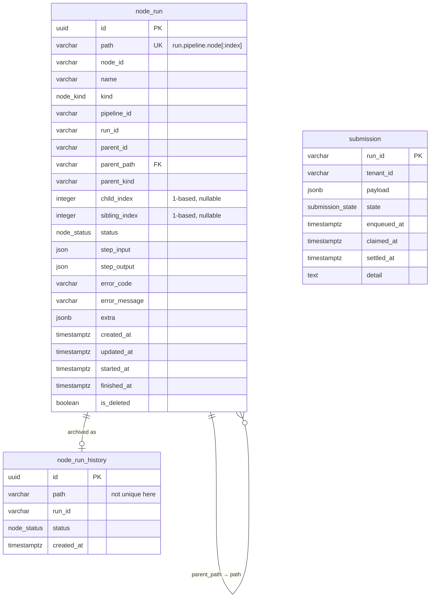
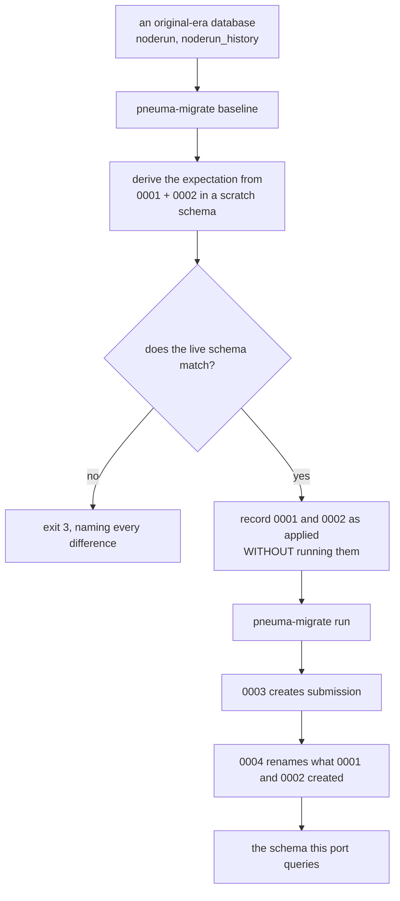

# Storage — two stores, and what each is for

## The split

| | PostgreSQL | MongoDB |
|---|---|---|
| Holds | `node_run`, `node_run_history`, `submission` | `runs`, `run_history` |
| Shape | one row per **step** | one document per **run** |
| Why | relational integrity, a self-referential parent key, partial indexes | a whole run's state read and written in one round trip |
| Read by | pneuma | pneuma, `pneuma-gateway` |

`pneuma-gateway`, which this port does **not** replace, reads the Mongo `runs`
collection and one Postgres table this port does not own: `termination`. It
does **not** read `node_run` —
an earlier version of this page said it read both stores, which was true only of
Mongo. What that constrains is the run document: the gateway indexes
`state.<node_id>` inside it, which is why `state` must be a flat map and not
nested.

`node_run` has exactly one writer and one reader, and both are this port's:
`pneuma-restate` and `pneuma-driver` write it through `pneuma-mirror`, and
`pneuma-janitor` reads it for stale-run detection and archives it. Until
The design notes nothing wrote it at all, which is why the janitor's
stale detection had never had a row to find.

## PostgreSQL



### `node_run`

One row per executing step. `path` is the coordination key, and what this port
writes is `{run_id}.{pipeline_id}.{node_id}` for a root step and
`{aggregator path}:{child_index}.{node_id}` for a step inside a fan-out — the
branch index on the prefix the whole branch shares, rather than on the branch's
first step as the original puts it. The design notes have the reasoning; the
property both schemes reach is that no two steps of a fan-out share a path,
which matters because `path` is `UNIQUE` and the insert is
`ON CONFLICT DO NOTHING` — a collision is not an error, it is a row that
silently never appears.

`parent_path` is a foreign key onto this table's own `path`, so a child cannot
be inserted before its parent. The delete path removes parents and children in
**one statement**, which is what keeps that constraint satisfied: Postgres fires
the constraint triggers at the end of the statement, by which time both are
gone.

Two details that are easy to get wrong and are load-bearing:

- `node_kind` labels are `PascalCase`; `node_status` labels are
  `SCREAMING_SNAKE_CASE`. Same table, different conventions, inherited from how
  the original ORM derived each.
- `step_input`/`step_output` are `JSON`; `extra` is `JSONB`. Not interchangeable.

### `node_run_history`

The same columns, deliberately **fewer constraints**: the primary key on `id` is
the only one. History can hold many rows for one path, and insert order does not
matter.

The `id` primary key is load-bearing in a way worth stating: rows are copied
from `node_run` with their ids intact, so backing the same node run up twice is
a key violation. That is exactly what wedges the janitor in the original system
(the defect notes) — the violation
aborts cleanup on every subsequent pass, permanently, because the step that
would stop the runs being re-selected never runs. The backup here is
`ON CONFLICT (id) DO NOTHING`.

### `submission`

**Not a port.** Nothing in the original has this table: it accepts a run and
dispatches it in the same breath, so a submission arriving while the controller
is down is a submission that never happened.

`run_id` is the primary key rather than a surrogate. That is what makes
`enqueue` idempotent under `ON CONFLICT DO NOTHING`, so a redelivered submission
— the ordinary case for any at-least-once transport — is a no-op rather than a
second run of work already queued.

Both indexes are **partial**:

- `ix_submission_queued (tenant_id, enqueued_at) WHERE state = 'queued'` —
  `queued` is the minority state in a healthy system, and the index has no
  reason to carry rows that have already run, which is all of them for ever.
  The column order is what `select_batch` consumes: a flow's backlog in arrival
  order.
- `ix_submission_claimed (claimed_at) WHERE state = 'claimed'` — for the
  watchdog that finds claims nobody settled. A claim is meant to be brief, so
  this index stays small even when the table does not.

`dispatch_round` is a **sequence**, `CYCLE`. See
[`flows.md`](flows.md#5-the-dispatch-round) for why it is not a column and not a
per-process counter.

## MongoDB

Database `pneuma`, collections `runs` and `run_history`.

A run document carries the run's identity, the **resolved graph snapshotted at
bootstrap**, and `state` — a flat map from node id to that node's state.

```json
{
  "_id": "job-7f3a",
  "run_id": "job-7f3a",
  "tenant_id": "acme",
  "pipeline_id": "invoice.page.default",
  "status": "processing",
  "pipeline": { "…the resolved definition, with its own _id stripped…" },
  "state": {
    "extract":  { "status": "finished", "step_output": { "…" } },
    "classify": { "status": "processing" }
  },
  "created_at": "…",
  "finished_at": null
}
```

Two ways to lose a run quietly, both closed:

- **`state` must be flat.** The gateway indexes `state.<node_id>`. Nesting it a
  level deeper leaves every one of those indexes matching nothing, and the
  symptom is a run that exists and reports no progress.
- **The pipeline's `_id` must be stripped.** Embedding the definition with its
  own `_id` intact makes every run after the first collide on insert, and the
  collision is silently read as a redelivery.

The index on `run_id` is called `ix_runs_run_id` (was `idx_run_id`), matching
the Postgres convention so the two stores read alike. It is **not** unique, and
is not named as though it were: the defect notes are the argument that
it should be, and making it so needs the running service to catch the conflict
first. A name asserting uniqueness would have an operator drop the old index
believing they had kept a guarantee they never had.

Mongo has no `ALTER INDEX`, so `pneuma-migrate mongo unique` performs the rename
by dropping the old index and building the new one. Creating alongside is not an
option — Mongo refuses a second index over the same key under a different name
with `IndexOptionsConflict` — which is why this is in the tool rather than left
to the runbook. Dropping before building is safe here *because* the index is not
unique: the window enforces nothing.

## The rename migration

Every name the original migration tool chose was replaced by one that says what the thing is. The
wire keys moved first, and a column is the same field one layer down; leaving
the columns behind would mean every query translating between two vocabularies
for ever.

| Kind | Old | New |
|---|---|---|
| table | `noderun` | `node_run` |
| table | `noderun_history` | `node_run_history` |
| enum | `nodestatus` | `node_status` |
| enum | `nodetype` | `node_kind` |
| column | `slug` | `path` |
| column | `parent_slug` | `parent_path` |
| column | `type` | `kind` |
| column | `parent_type` | `parent_kind` |
| column | `child_idx` | `child_index` |
| column | `nth` | `sibling_index` |
| constraint | `noderun_parent_slug_fkey` | `node_run_parent_path_fkey` |
| constraint | `uq_noderun_slug` | `uq_node_run_path` |
| index | `ix_noderun_*` | `ix_node_run_*` |
| Mongo collection | `runhistory` | `run_history` |
| Mongo index | `idx_run_id` | `ix_runs_run_id` |

`crates/pneuma-store/migrations/0004_rename.sql` does it with `ALTER … RENAME`,
not drop-and-create. That is a catalogue update: it takes an `ACCESS EXCLUSIVE`
lock for the instant it runs, rewrites no rows, and keeps every index,
constraint and grant attached. On a `noderun` of any production size the
difference from a create-copy-drop is the whole maintenance window.

**Postgres does not rename indexes and constraints when their table is
renamed.** `noderun_pkey` survives a `noderun → node_run` rename under its old
name. That is not cosmetic here: `pneuma-migrate` fingerprints indexes and
foreign keys *by name*, so an index left with its old name is a permanent
`baseline` mismatch against a database that is in fact correct. Each one is
renamed explicitly.

### Why `0001` and `0002` were not edited



`ORIGINAL_THROUGH` is **2**. `0001` and `0002` transcribe the original migration tool revisions, so a
production database has both; `0003` creates `submission`, which the original migration tool never
made and no existing database has. Baselining against all four would either
refuse a database that is in fact correct, or — if the comparison were loosened
— record `0003` as applied against a database with no `submission` table, so
`sqlx migrate run` would skip creating it and every submission query would fail
at run time on a deployment whose baseline reported success.

`0004` is the same argument from the other end: an original-era database has the
*old* names, so it can only match an expectation built from `0001` and `0002`
alone. Editing those two would make every existing database mismatch at the one
moment it must not.

### What the fingerprint sees, and what it does not

`Schema::differences` returns **every** difference, not the first: an operator
reconciling a schema wants the list, not one round trip per discrepancy. Extra
is a difference too — a live database with a column the migrations do not create
is not a match, and the usual cause is a migration that ran and was then edited.

It does **not** see: row-level security, index validity, triggers, grants and
ownership, column order, or anything that is not a table, an enum, an index or a
foreign key. None of those is an oversight to be fixed by adding it — each would
make the fingerprint fail for a difference nobody can act on in the middle of a
baseline. It answers "do the migrations describe these tables", not "are these
two databases the same".

One thing it *now* sees that it did not: a schema qualifier anywhere in a
rendered definition, not just after ` ON ` or `REFERENCES `. `0003`'s partial
indexes and enum default render as
`'queued'::<schema>.submission_state`, which the old positional normalisation
could not reach — so two schemas built from identical SQL compared unequal.
Matching the schema's own name is exact rather than positional, and safe inside
a `CHECK`, which the positional rule was not.

## Running the migration

```sh
# 1. adopt an existing the original migration tool-era database (exit 3 if it does not match)
pneuma-migrate baseline

# 2. apply 0003 and 0004
pneuma-migrate run

# 3. Mongo: rename the run_id index
pneuma-migrate mongo unique
```

Then, by hand and only once the deployment is on the new names — the one storage
change no code performs, because the janitor takes both collections from its
caller:

```js
db.runhistory.renameCollection("run_history")
```
