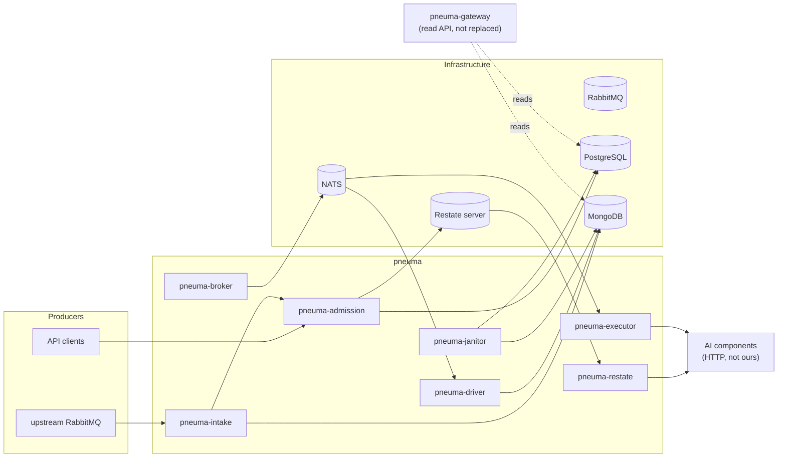

# Context — what pneuma is, and what it is for

## The problem

A pipeline is a directed graph of AI components. A document arrives; it is
split into pages; each page runs through a chain of models; the results are
aggregated back into one answer. The graph is **declarative data** — YAML,
authored by the people who own the models — not code, and the system's job is
to interpret it: schedule the steps whose prerequisites are met, call the
components, collect the results, decide what becomes runnable next, and record
enough that a restart resumes rather than restarts.

Three things make that harder than it sounds:

- **The fan-out is unbounded.** A 10,000-page document is 10,000 sibling steps
  under one aggregator, and the aggregator must not fire until every one of them
  has landed — exactly once, whatever the transport did.
- **The tenants share everything.** One busy customer must not starve the
  others, and "fair" has to mean fair over time rather than fair per batch.
- **The components are not ours.** They are inference servers written by other
  people, in other languages, with no SDK from us. Whatever contract they are
  given has to be small enough to implement in an afternoon.

## What it replaces

Three services of the previous system:

| Previous service | What it did |
|---|---|
| controller | bootstrap, the interpreter, the janitor |
| original executor | called components over HTTP and published results |
| broker | routed an inbound message onto a per-tenant subject |

`pneuma-gateway` (Rust) is the platform's read API and is **not** replaced; it
reads the same stores and its expectations bind this port — see
[`as-built/storage.md`](as-built/storage.md).

The port is not a translation: it closes defects found in the system it
replaces and deliberately behaves differently in places. The most consequential:

- a cancelled node could be resurrected by a late result, because the database
  guard omitted `CANCELLED` while the domain type did not
- the janitor's history backup was a plain `INSERT`, so one repeated pass
  wedged cleanup permanently
- a tenant id was interpolated into a NATS subject unvalidated
- a duplicate insert was an error rather than the success it actually is

## The four differentiators

From [`STRATEGY.md`](STRATEGY.md), each checked against the alternative's
own documentation rather than asserted:

1. **No determinism constraint.** The graph is data interpreted by a fixed
   engine, so there is no workflow function to replay and no non-determinism
   error to hit. Temporal's constraint exists because workflow logic is code;
   here the precondition does not exist.
2. **Zero-SDK components.** A component is one HTTP endpoint. Any inference
   server is a valid component with no framework buy-in and no language
   lock-in. [`as-built/component-api.md`](as-built/component-api.md) is the
   whole contract.
3. **No architectural fan-out ceiling.** A flat node-run table plus a broker has
   no equivalent of Temporal's ~2,000 pending activities or ~50K events per
   execution. Wide fan-out is a tuning question, not a redesign.
4. **Tenant isolation at the transport.** A subject per tenant, natively, at a
   cardinality where namespace-per-tenant stops being practical elsewhere.

## Where it sits

The two paths from a submission to a component call — Restate and NATS — are
the subject of [`as-built/protocols.md`](as-built/protocols.md). They are not
redundant copies of each other: Restate is the primary and the NATS path is the
fallback for a deployment that cannot run a Restate server, per
[`BROKER-PORTABILITY.md`](BROKER-PORTABILITY.md).
