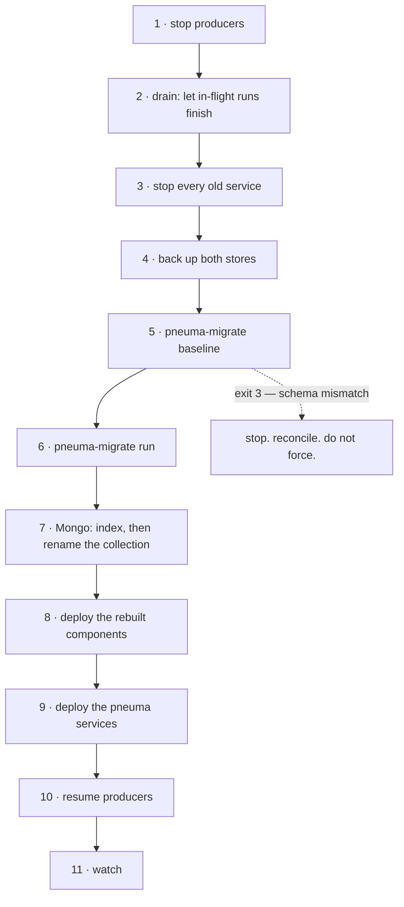

# Runbook — cutover, operation, and what to do when something is wrong

## The cutover is not gradual

the original plan originally allowed the Rust services to run beside the original ones
one process at a time. That is **gone**. The wire keys, the subjects, the
environment variables, the storage names and the component protocol all changed
together, so a mixed deployment does not work in either direction:

- an old producer's `runinfo`/`slug`/`nth` keys are ignored by a new consumer
- a new producer's `node`/`path`/`sibling_index` keys are ignored by an old one
- an old component reading `jsonData` receives a body without it
- an old service reading `noderun` finds no such table

Everything changes in one window. That is the cost recorded in
The design notes, and this page is what makes it a
procedure rather than a surprise.

## Order of operations



### 1–3. Quiesce

Stop the producers first, then let the in-flight runs finish, then stop the
services. A run that is mid-flight when the services stop is not lost — its node
rows and run document survive — but it will resume against a schema whose column
names have changed, and there is no reason to find out how that goes.

Check that nothing is in flight:

```sql
SELECT count(*) FROM noderun
WHERE status NOT IN ('FINISHED','ERROR','TIMED_OUT','CANCELLED',
                     'AGGREGATED','HAS_CHILD_ERROR','HAS_CHILD_TIMED_OUT');
```

### 4. Back up both stores

Not optional. `0004_rename.sql` is reversible in principle — every statement has
an inverse — but "in principle" is not a rollback plan at 03:00.

```sh
pg_dump "$DATABASE_URL" > pre-rename.sql
mongodump --uri "$PNEUMA_MONGODB_URL" --db "$PNEUMA_MONGODB_DATABASE" --out pre-rename/
```

### 5. Adopt the existing schema

```sh
pneuma-migrate baseline
```

This compares the live schema against what migrations `0001` and `0002`
produce — the two that transcribe the original migration tool revisions — and, if they agree,
records them as applied **without running them**.

| Exit | Meaning | What to do |
|---|---|---|
| 0 | adopted, or already adopted | continue |
| **3** | the live schema does not match | **stop** |

Exit 3 prints every difference, not the first. Reconcile them; do not force
past it. The failure this step exists to prevent is recording migrations as
applied against a database that does not have what they describe — after which
`migrate run` skips creating things that were never there, and the failure
surfaces at run time on a deployment whose baseline reported success.

### 6. Apply the rest

```sh
pneuma-migrate run
```

Applies `0003_submission` (new — the original migration tool never created it) and
`0004_rename.sql` (the rename). The rename is a catalogue update: an
`ACCESS EXCLUSIVE` lock for the instant it runs, no rows rewritten. On a table
of any size it is effectively instant.

Verify:

```sql
\d node_run
\di ix_node_run*
SELECT typname FROM pg_type WHERE typname IN ('node_kind','node_status');
```

All four migrations should now be recorded:

```sql
SELECT version, description, success FROM _sqlx_migrations ORDER BY version;
```

### 7. Mongo

Mongo has no migration runner, so this is three steps by hand.

```sh
pneuma-migrate mongo unique     # renames idx_run_id to ix_runs_run_id
```

Despite the subcommand's name this index is **not** unique, and never has been.
The defect notes are the argument that it should be; making it so needs
the running service to catch the conflict first, and until then a name claiming
uniqueness would be worse than the old one. Nothing to do here but know it.

The command performs the rename itself — dropping `idx_run_id` and building
`ix_runs_run_id` — because Mongo has no `ALTER INDEX` and refuses a second index
over the same key under another name. Running it twice is a no-op.

Then, in `mongosh`, against the **new** database name:

```js
// The database rename is a copy, not an operation — Mongo has none.
// Either migrate the data into the `pneuma` database, or keep the existing
// database and point PNEUMA_MONGODB_DATABASE at it. Both are supported.
db.runhistory.renameCollection("run_history")
```

That collection rename is the one storage change no code performs: the janitor
takes both collections from its caller, so the name is a deployment decision
rather than a migration.

### 8. The components, before the services

The rebuilt models must be live **before** any pneuma service calls one. A
service deployed first calls a model that still expects `jsonData` and every
step fails. See [`as-built/component-api.md`](as-built/component-api.md) — the
change is deleting one level of nesting at each end.

### 9. The services

Deploy all of them together. Configuration changes with them: every variable
carries the `PNEUMA_` prefix except `DATABASE_URL`, and the defaults are in
[`as-built/protocols.md`](as-built/protocols.md#environment-variables).

Watch for these at startup — all of them are deliberate refusals, not crashes:

| Symptom | Cause |
|---|---|
| `PNEUMA_COMPONENT_ENDPOINT` missing | it has no default on purpose |
| `DATABASE_URL is required` | new on `pneuma-restate` and `pneuma-driver` — see below |
| `the database has no node_run to mirror into` | the DSN opens, but the migrations have not run in the schema it points at |
| `PNEUMA_LISTEN is not a socket address` | a hostname where an address belongs |
| `… must be between 1 and N` | a tuning knob at zero, or a pasted microsecond epoch |
| `entry is not tenant=weight` | a mistyped `PNEUMA_TENANT_WEIGHTS` |
| a blank variable | treated as unset, not as an empty value |

**`DATABASE_URL` is new on the two drive paths.** `pneuma-restate` and
`pneuma-driver` now write a `node_run` row per step, and neither starts without
a database it can reach *and* mirror into. That is deliberate: a service that
runs, reports healthy and mirrors nothing is indistinguishable from one that
works, and the symptom would surface weeks later as the janitor finding no stale
runs. Give both the same DSN `pneuma-admission` and `pneuma-janitor` already
have. The design notes

**Drain before deploying `pneuma-restate`.** Mirroring adds entries to the
Restate journal, so a run that was in flight when it is deployed resumes against
a journal shape it was not started with. This rides along with the drain step 4
already prescribes — it is not an extra outage, but it is a reason not to skip
that step for "just a service deploy".

### 10–11. Resume, and watch

Resume the producers. Then, for the first hour:

```
GET /{service}/liveness        on every service
```

and the four numbers that say whether the system is actually moving:

```sql
-- work arriving
SELECT state, count(*) FROM submission GROUP BY state;

-- claims nobody settled (should be near zero and never growing)
SELECT count(*) FROM submission WHERE state = 'claimed'
  AND claimed_at < now() - interval '5 minutes';

-- steps in flight. Before the mirror existed this was always empty, so a
-- non-zero answer here is itself the check that the drive path is writing.
SELECT status, count(*) FROM node_run GROUP BY status;

-- the round counter advancing
SELECT last_value FROM dispatch_round;
```

## Rolling back

Up to and including step 6, roll back by restoring the backup. After step 9 the
components are on the new protocol and rolling the services back means rolling
the components back too.

`0004_rename.sql` has an exact inverse — every `ALTER … RENAME` reversed, in the
opposite order — but writing it under pressure is how a rename becomes a data
loss. Restore the dump.

## Running it

### The janitor

Its passes are idempotent by construction, so two janitors racing produce one
outcome. Nothing is deleted that was not copied first, and any step failing
abandons the pass and leaves the runs finalised, so the next pass repeats from
the top — a failed pass is a log line, not a stop.

`PNEUMA_INTERVAL_MINUTES` is a number of minutes, not a cron field: a deployment
running `INTERVAL_MINUTES=*/5` today sets `PNEUMA_INTERVAL_MINUTES=5`. A value a
plain interval cannot express is refused at startup rather than rounded.

Set `PNEUMA_MONGODB_RUNS_COLLECTION` and `PNEUMA_MONGODB_HISTORY_COLLECTION` to
**different** names. They default to `runs` and `run_history`, and the process
refuses to start if they agree — the archive is a `$merge` from the first into
the second, so one name for both would merge the live collection into itself and
then delete it.

For the week the original plan asks for — a production run diffed against
the original janitor before this one is allowed to act — run it with
**`--dry-run`** and `PNEUMA_STALE_TERMINATION_ENABLED=true`.

The two are not the same knob and the difference matters:

| | selects stale runs | archives, deletes, terminates |
|---|---|---|
| `--dry-run`, flag on | **yes** | no |
| `--dry-run`, flag off | no | no |
| live, flag off | no | archives and deletes only |
| live, flag on | yes | yes |

`PNEUMA_STALE_TERMINATION_ENABLED=false` turns the stale *selection* off
entirely, so a week of passes with it reports `0 stale` however much work is
stuck — which reads as "nothing was ever stale" and is the opposite of the
evidence the phase gate wants. `--dry-run` is what makes a pass change nothing;
its log line says `would terminate N` rather than `terminated N`, so the two are
distinguishable in a week of logs.

`PNEUMA_STALE_AFTER_SECS` at or below zero is refused at startup rather than
accepted, because at zero every in-progress node is stale and every active run
is terminated.

**Stale detection has something to detect now, and did not before.** The
selection reads `node_run`, and until the design notes nothing in this port
wrote that table — so on a database this port had populated on its own, a week
of passes would have reported `0 stale` no matter what was stuck, and the flag
would have looked like it worked. On a database carried over from the original
controller the rows were there and the selection was live. Either way, the
diff week is worth running *after* the drive paths have been mirroring for long
enough to have produced rows of their own.

**A pass is bounded.** The termination phase gets at most half the interval;
anything not attempted is reported as `deferred N` and picked up next pass,
because the selection repeats. Without that bound one pass against an
unresponsive gateway is `PNEUMA_RUN_BATCH_SIZE × PNEUMA_GATEWAY_TIMEOUT_SECS` —
at the defaults, seventeen minutes inside a five-minute schedule — and the
archival and retention work that runs *first* simply stops happening.

**`liveness` says whether passes are still firing.** `PNEUMA_INTERVAL_MINUTES`
plus `PNEUMA_ALERT_MISS_GRACE_SECS` is the deadline: past it, the `passes` check
reports degraded and `/pneuma-janitor/liveness` answers 503. `healthz` still
answers 200 — the process is running, and a restart is not the remedy for a pass
that is slow. Alert on the former.

### Retention

`PNEUMA_RETENTION_DAYS` at zero or below means **keep for ever**, matching the
original. History is retained from when it was *archived*, not from when the run
was created — the design notes The original measured
from creation, so a long-lived run was archived and deleted in the same pass
(the defect notes).

### Scaling

| Service | Scale on | Safe because |
|---|---|---|
| `pneuma-admission` | HTTP latency, submission rate | the round counter is a shared sequence; unsettled claims are reclaimed |
| `pneuma-intake` | AMQP queue depth | `enqueue` is idempotent on `run_id` |
| `pneuma-executor` | `pneuma.step` depth | a queue group — one replica gets each step |
| `pneuma-driver` | in-flight runs | every replica sees every result; only the run's owner claims it |
| `pneuma-restate` | Restate's own invocation load | the journal makes replica choice irrelevant |
| `pneuma-broker` | `pneuma.input` depth | a queue group |
| `pneuma-janitor` | do not | one pass is enough; two are harmless |

## When something is wrong

### Submissions accepted, nothing runs

Check `submission` for rows stuck in `claimed`. A claim that is never settled
means the dispatcher reached the Restate ingress and then died, or could not
reach it at all. The reclaim sweep returns those to `queued` after
`PNEUMA_RECLAIM_AFTER_SECS`; if they are not coming back, the sweep is not
running — check the dispatcher's readiness.

An unreachable Restate deliberately leaves the row `claimed` rather than
settling it `failed`: settling would be a permanent verdict on a transient
problem.

### A run exists and reports no progress

Two known shapes, both in the run document:

- `state` is nested rather than flat, so `pneuma-gateway`'s `state.<node_id>`
  index matches nothing
- the embedded pipeline definition kept its own `_id`, so this run collided with
  the first one on insert and was read as a redelivery

### Every step fails immediately after the cutover

The components were not rebuilt. A model still reading `jsonData` receives a
body without it. Confirm by calling one directly with the shape in
[`as-built/component-api.md`](as-built/component-api.md).

### `baseline` reports a mismatch on a database you believe is correct

Read the differences — it prints all of them. The two that are not real drift:

- an index or constraint left under its old name, because Postgres does not
  rename them with their table. `0004_rename.sql` renames each explicitly; a
  database that was renamed by hand may have missed one.
- nothing else. The fingerprint no longer reports a schema qualifier as a
  difference, in any position.

### The DLQ is filling

Look at what is in it before draining. A dead-letter is the "unrecoverable"
answer, which for a component call means a `4xx` or a body with no
`step_output` — not a network failure, which is retried, and not a timeout,
which reports separately.

## What is deliberately not read

`TIMEZONE`. The original janitor declares it and uses it in one place: the
retention cutoff, as `datetime.now(tz) - timedelta(days=N)` converted back to
UTC. Those two conversions cancel, so the cutoff is the same instant for every
value — and the scheduler passes `timezone=UTC` explicitly, so the cron fields
never saw it either.

Setting it changes nothing in the original, and it is not read here. Reading a
variable that changes nothing is worse than not reading it: it tells an operator
the knob works. The design notes works through it, and
a test asserts the omission.
