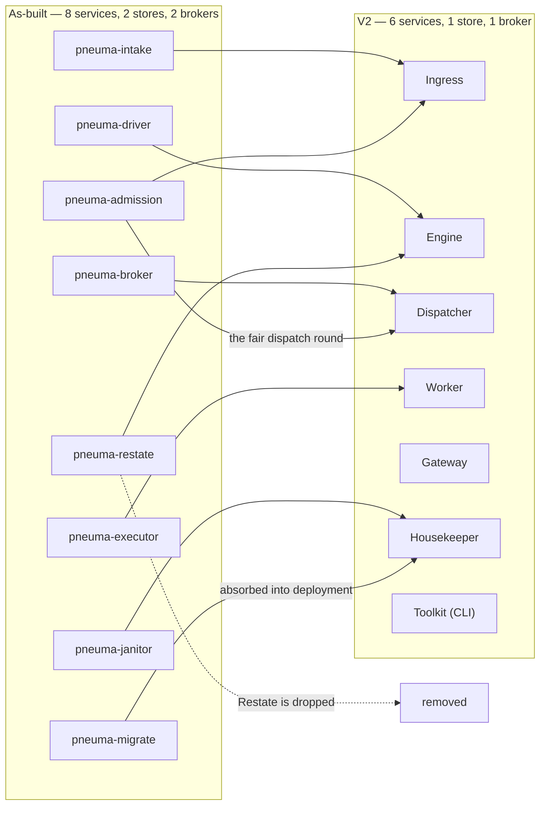
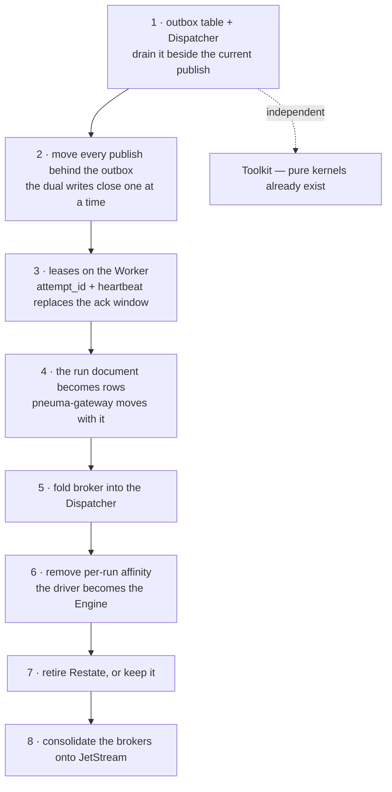

# V2 — what would have to change, and in what order

A route from the system that runs to the one
[`overview.md`](overview.md) describes. Nothing here is scheduled; it is written
down so that the question "how far is it?" has an answer other than a shrug.

## The shape of the move

| Today | V2 | What it costs |
|---|---|---|
| `pneuma-intake` | → Ingress | small; the transactional create replaces the dual write |
| `pneuma-admission` | → Ingress **and** Dispatcher | the fair-selection code moves to the Dispatcher, the accept path to Ingress |
| `pneuma-driver` | → Engine | the affinity goes away; this is the biggest single change |
| `pneuma-restate` | **deleted** | the journal is replaced by outbox + leases; every component must become idempotent |
| `pneuma-broker` | **deleted** | one `format!` moves into the Dispatcher |
| `pneuma-executor` | → Worker | leases replace the ack window; it gains its own result outbox |
| `pneuma-janitor` | → Housekeeper | the staleness heuristic becomes an invariant |
| `pneuma-migrate` | absorbed | still needed, still a CLI |
| MongoDB | **deleted** | the run document becomes rows; the gateway must move with it |
| RabbitMQ | **deleted** | client callbacks move to JetStream |
| `MessageRetry` | **deleted** | superseded by lease expiry and broker redelivery |

## Order of work

The order matters because two of these steps are only safe once an earlier one
has landed.

**1 and 2 are worth doing regardless of V2.** An outbox is not a V2 feature; it
is the fix for a dual write, and the as-built system has one at intake. They can
land in the running system without any other part of this page happening.

**3 before 6.** Removing per-run affinity means any replica can pick up any
result — which is only safe once a slow component cannot cause duplicate
dispatch. The ack-window guess is what makes that unsafe today.

**4 before 5 is not required but is cheaper.** The Dispatcher's cancellation
check is a Postgres read; while the run's status lives in Mongo it is a second
store's read on the dispatch path.

**7 is a decision, not a step.** Restate can stay: an Engine that commits a
transaction and a Restate handler that journals a call are not mutually
exclusive, and keeping the journal keeps component idempotency optional. Dropping
it is what makes the six-service count true, and pushes idempotency onto every
component author — which is the trade
[`rationale.md`](rationale.md#where-as-built-is-straightforwardly-better)
describes.

## What does not move

`pneuma-core` and `pneuma-interpreter` are untouched by all of it. The resolver,
the evaluator, the status guard and the superstep decision are pure functions
with no I/O, and V2's Engine is described as inheriting them "almost unchanged
behind a thin transactional shell". That is the single strongest argument that
the port's crate boundaries were drawn in the right place: the most invasive
redesign anyone has proposed does not reach them.

It is also what makes the Toolkit nearly free — `pneuma validate` and
`pneuma run --local` are those kernels plus the in-memory fakes the test suite
already has.

## The one thing to do first

Not on this diagram, and not V2's idea: **measure the outbox.**
`ARCHITECTURE-V2.md` is explicit that "a well-tuned primary plausibly sustains
tens of thousands of simple indexed writes per second on a table this shape" is
an estimate rather than a benchmark against this schema. Tier 1 (`SKIP LOCKED`
competing consumers, no partitioning) is almost certainly enough for a long
time, and Tier 2 is real distributed-systems scope. Which of those is true
decides how much of this page is worth reading twice.
