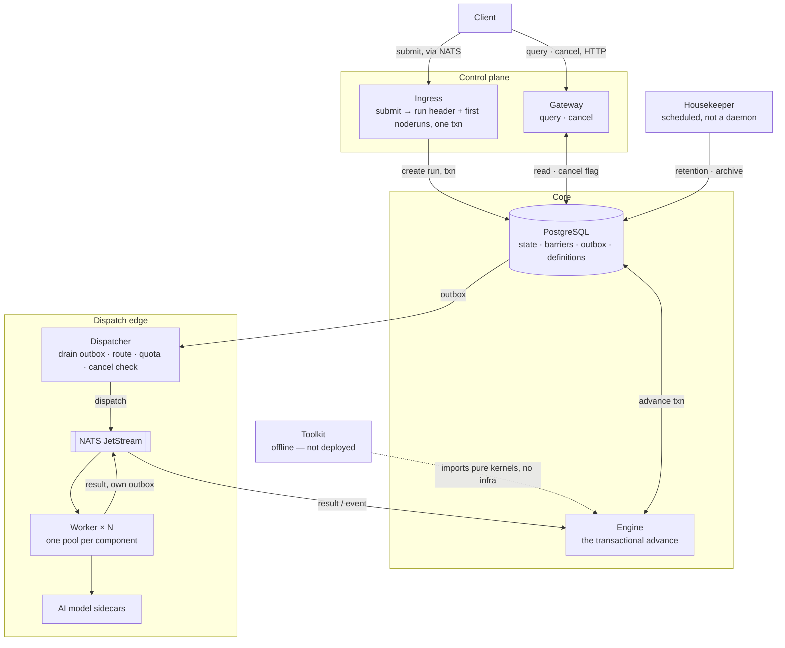
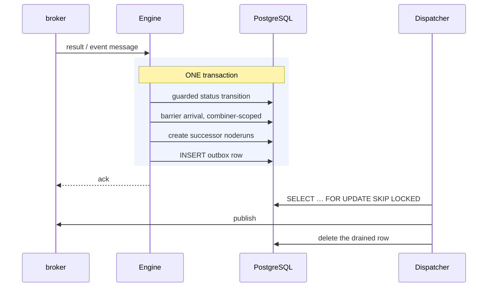
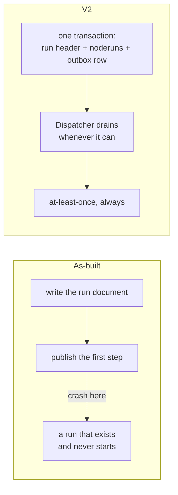

# V2 — the six-component architecture

**This is a design, not the system.** Nothing in this directory is implemented.
It is what the boundaries would be if they were drawn again from scratch,
knowing what the port learned. The system that runs is
[`../as-built/`](../as-built/overview.md).

The source is [`../../ARCHITECTURE-V2.md`](../ARCHITECTURE-V2.md), which
synthesises [`CONCURRENCY-AND-DIRECTION.md`](../CONCURRENCY-AND-DIRECTION.md)
(Postgres-only, transactional advance), [`PREGEL-NOTES.md`](../PREGEL-NOTES.md)
(combiner barrier, vote-to-halt termination) and
[`STRATEGY.md`](../STRATEGY.md) (the four differentiators) into a
topology. It declares itself to supersede
the original plan's "mirror today's binaries" decision —
which was the right call for a safe incremental port, and is a different
question from "what would you build now".

## The rule that draws the boundaries

Not one service per file, and not one service per feature. A boundary earns its
existence only if it has a genuinely different **scaling axis**, **failure blast
radius**, **ownership**, or **I/O interaction model** from its neighbours.

That fourth criterion is the one most easily missed, and it is why Ingress and
Gateway stay apart despite both being thin request handlers over the same
Postgres: a pull-based durable-consumer loop (backpressure from queue depth,
readiness means "connected and caught up", shutdown means "drain what is in
flight") and a synchronous HTTP server (scaling trigger is concurrent
connections, readiness means "accepting", shutdown means "stop accepting") are
different runtime disciplines.

## The topology

| # | Component | Scaling axis | If it is down |
|---|---|---|---|
| 1 | **Ingress** | job submission rate | new jobs queue; in-flight runs unaffected |
| 2 | **Engine** | in-flight step-transition rate | runs stop advancing; nothing corrupts, nothing duplicates |
| 3 | **Dispatcher** | total dispatch rate | advance transactions still commit; work backs up in the outbox |
| 4 | **Worker** (× N) | per-component inference load | only that component's steps stall |
| 5 | **Gateway** | external read/cancel traffic | the pipeline keeps running; visibility degrades |
| 6 | **Housekeeper** | none — scheduled | retention slips; nothing on the hot path notices |
| — | **Toolkit** | not deployed | — |

Substrate, not services: **one** Postgres cluster (state, barriers, outbox,
definitions — Mongo is gone) and **one** broker, for dispatch and result
transport only.

## The transactional advance

This is the whole idea, and the reason the topology looks the way it does.

The Engine **does not call NATS and does not call HTTP.** It touches Postgres
and nothing else. Every write is idempotent via `ON CONFLICT DO NOTHING`.

That constraint is the point: **any replica can process any message for any
run**, because there is no per-run affinity anywhere. The as-built driver has
exactly that affinity — a run's `Execution` lives in one replica — and it is the
clearest single difference between the two designs.

## The outbox, and what it deletes

A dual write is "commit to the database, then publish to the broker", and it
fails in the gap. V2 has no dual write anywhere, including at the very first
step: Ingress does not publish the first dispatch, it writes an outbox row like
every later one, and the Dispatcher drains it.

## Component by component

### 1. Ingress — *was bootstrap*

Accepts a submission, resolves the definition, and in one transaction creates
the run header and the initial node runs. Nothing else. Separate for two
independent reasons: submission-rate scaling has nothing to do with
in-flight-run scaling, and it is a *consumer*, not a *server*.

### 2. Engine — *was the controller, with dispatch removed*

The smallest and most heavily tested component. Consumes result and event
messages and executes the transactional advance. Inherits `pneuma-core`'s pure
kernels almost unchanged behind a thin transactional shell — which is what makes
the Toolkit nearly free.

Gone from here: the retry-message self-loop, replaced by lease expiry and
broker-native redelivery. The racy aggregate re-read, replaced by the combiner's
atomic delivery. Termination consumption, because "is this cancelled" is now a
plain Postgres read.

### 3. Dispatcher — *new*

The one genuinely new boundary. Four things that were smeared across two and a
half services for no principled reason:

- draining the outbox, with idempotency keys and the broker's dedup window
- **tenant routing** — `broker`'s entire reason to exist becomes one step
  here instead of a whole deployment, network hop, durable consumer and lossy
  JSON re-marshal
- **per-tenant rate limiting and quota**, which belong at the one chokepoint
  every dispatch already passes through — turning differentiator 4 from "a
  subject suffix with no enforcement" into something real
- **the cancellation check**, as an indexed Postgres read taken *before* the
  dispatch is sent

Separate from the Engine so broker trouble degrades to "work backs up in a
durable table" rather than "database transactions start failing".

**How it scales, in two tiers.** Tier 1 is
`SELECT … FOR UPDATE SKIP LOCKED` — the standard competing-consumers pattern.
N replicas poll the same outbox table; each grabs a batch and row-locks it; the
rest skip locked rows. Zero partitioning, zero routing, zero coordination. Tier
2 — past one Postgres primary — is real horizontal sharding, and if it is ever
built the key is **`tenant_id`, not `run_id`**: hashing by run id scatters one
tenant across every shard for no benefit, since nothing needs cross-run
atomicity within a tenant.

### 4. Worker — *was the original executor, same shape, corrected mechanism*

One deployment per component; that part of the existing design was already
right. What changes is mechanism: leases with an `attempt_id` and a heartbeat
instead of guessing an ack window against a request timeout; a durable pull
consumer filtered to this component instead of a producer that scans subject
cardinality; a local cancellation cache; and **its own outbox for results**, so
a crash between "inference finished" and "result published" does not lose the
result.

The component contract itself is unchanged in role — one HTTP endpoint, no SDK.
As-built has since simplified its shape: see
[`../as-built/component-api.md`](../as-built/component-api.md).

### 5. Gateway — *same role, simpler underneath*

Loses its Mongo dependency entirely; cancellation becomes a flag write rather
than a fan-out-and-poll dance; gains a run-inspector surface, because it is
already the service whose job is "external things query pipeline state".

### 6. Housekeeper — *was the janitor, radically simpler*

Same job, but "is this run actually finished" stops being a heuristic timeout
guess and becomes a checkable invariant: every reachable vertex halted, outbox
empty for that run. A scheduled job, not a daemon.

### 7. Toolkit — *not a service*

`pneuma validate pipeline.yaml` and `pneuma run --local`, built by importing the
Engine's pure kernels with in-memory fakes — the same fakes the test suite
needs anyway. It has to be a CLI, not a deployment, or it defeats its own
purpose: a pipeline author catches a cyclic graph on their laptop, before it
becomes a silent production hang.
